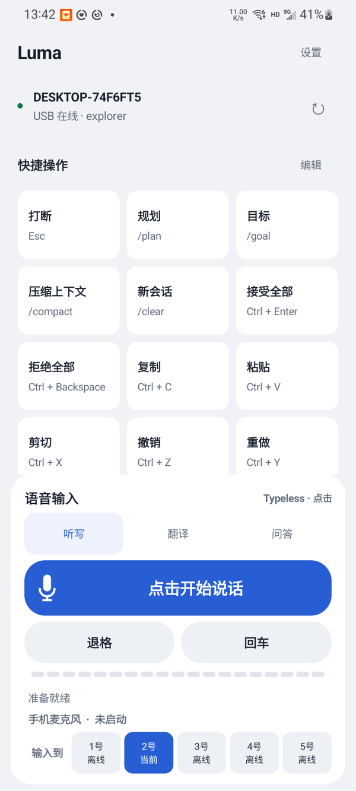
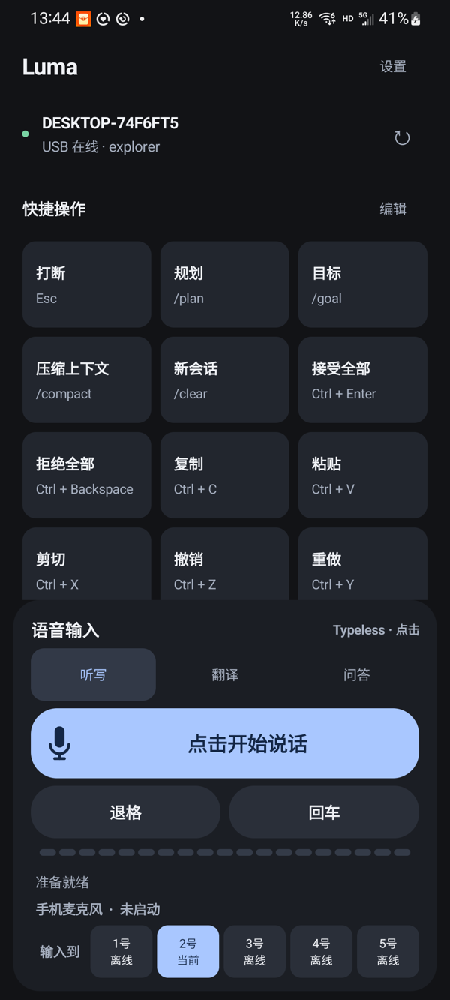

# PhoneDeck 手机控制台

> **English** — PhoneDeck turns a spare Android phone into a voice-input panel and a programmable shortcut console for Windows (macOS in preview): the phone supplies the microphone, your PC's dictation software does the transcription, and the phone can also send shortcuts like copy / paste / screenshot or custom macros. Grab the pre-built binaries from the [v1.6.0-beta.1 release](https://github.com/leolemon777/PhoneDeck/releases/tag/v1.6.0-beta.1) and follow its QUICKSTART. Docs are Chinese-first; English contributions welcome.

PhoneDeck 把一台闲置 Android 手机变成电脑的语音输入面板和可编程快捷键控制台。手机麦克风负责采集声音，电脑端语音输入软件负责语音转文字；手机还可以发送复制、粘贴、截图、F1 等快捷键。长期目标是 Android / iOS 手机自由搭配多台 Windows / macOS 电脑，提供共享麦克风、可选语音输入法和主题。iOS 尚待开发，Mac 仍为预览；实验引擎不等于正式支持。

当前源码为 **Android 1.6.0-dev.21 / Windows 接收端 1.6.0-dev.16**。本轮实现、手机安装通道限制与未验收项见 [手机统一设置记录](docs/PHONE_MANAGED_DESKTOP.md)。上一版完整实机稳定基线是
**PhoneDeck 1.4.0**。1.5.0 已通过 Android、Windows 构建、长期签名、真机安装和
一轮真实 ADB 服务断开/恢复验证，但仍需完成快捷键编辑、真实输入、连续断线、
VB-CABLE、Typeless 和蓝牙验收后才能视为正式稳定版。macOS 方向已启动
**2.0.0-dev.3 接收端预览**：Core Audio / BlackHole 与双语音模式源码已接入，20 项
跨平台测试通过；真实 Mac 和三机锁屏共享验收尚未进行。

面向开源发布的完整路线见 [长期规格 v0.6 第 0 章](./spec%20plan.markdown)：
无线首次配对与逐手机授权、动态多电脑管理、Mac 实机完善、四类语音输入法分级适配、
iOS 原生客户端、主题与状态统一、签名分发和维护体系。第一轮容量目标为一台手机连接
五台电脑，后续按实测扩展。方向已确认，技术方案和排期为建议；不代表上述能力已经实现。

| 浅色主题 | 深色主题 |
|---|---|
|  |  |

## 项目所有者真正想实现什么

1. 闲置 Android / iOS 手机长期作为辅助键盘和手机麦克风使用（iOS 为后续目标）。
2. 手机一键唤醒或停止电脑端语音输入软件（Typeless 为默认，档案化适配豆包、微信输入法等，见 docs/VOICE_ENGINES.md）。
3. 点击模式用同一个主按钮开始/停止；按住模式仍是按下开始、松开停止。
4. 快捷键按钮可由用户修改，例如把“截屏”改为 F1，或配置 Ctrl+C、Ctrl+Shift+S。
5. 加入 `/goal`、`/plan`、`/compact` 等文本命令，并为 Codex、Claude Code、ZCode、Cursor 提供语义化预设。
6. 一台手机自由管理多台 Windows / macOS 电脑，首轮目标覆盖 1–5 台；普通动作进入当前电脑，未来共享范围由用户独立选择。
7. 支持直接 USB、USB 共享切换器、本地无线和蓝牙备用，不把产品锁死在一种传输方式上。
8. 项目可迁移到其他电脑继续开发、构建和发布。

完整、长期有效的产品规格见 [spec plan.markdown](./spec%20plan.markdown)。新的 Agent 在修改代码前必须先阅读该文档和 [AGENTS.md](./AGENTS.md)。

## 当前已经可以使用的功能

- Windows/Android 设备统一更新：手机导入签名包或读取已接入电脑的缓存，手机协调分发、逐台反馈，电脑自动替换与失败回退；安卓按系统提示安装。未接入过的电脑首次使用需先安装接入版本，详见 [统一更新说明](./docs/FLEET_UPDATES.md)。
- 原生 Android Java App，最低 Android 8.0（API 26）。
- Windows x64、.NET 8 自包含接收端。
- USB ADB 反向隧道，服务仅监听 `127.0.0.1:8765`。
- 手机麦克风以 48 kHz / 16-bit / 单声道 PCM 传输到电脑。
- 两套互斥语音工作方式：手机按钮控制当前电脑的听写，或手动开启常驻共享麦克风，
  由每台电脑自己的 Typeless 快捷键决定是否转写。
- 共享麦克风用同一个 `sessionId` 向所有已配对、在线、声明 `sharedMicrophone` 且音频
  就绪的接收端扇出；每台电脑有独立有界队列和重连退避，单台故障不阻塞其余电脑。
- 共享模式使用 Android 麦克风前台服务，可在后台/锁屏继续；通知和主按钮均可停止，
  服务采用 `START_NOT_STICKY`，App 或手机重启后不会自动恢复采音。
- Windows 通过 NAudio/WASAPI 将音频写入 `CABLE Input (VB-Audio Virtual Cable)`。
- 语音引擎档案化：内置 Typeless（自动读取其配置与快捷键，失败退回 RightAlt）、豆包、微信输入法，支持切换式（按一下）与按住式（hold）触发；用户可在 data 目录的 voice-engines 子目录放置 JSON 零代码新增/覆盖引擎，详见 [docs/VOICE_ENGINES.md](./docs/VOICE_ENGINES.md)。
- 手机「设置 → 电脑与输入法」逐台选择引擎、覆盖快捷键、调整 USB 恢复/局域网发现/登录启动，保存后立即生效。Windows 仅保留原生托盘、状态窗口和重连；见 [手机统一设置](docs/PHONE_MANAGED_DESKTOP.md)。
- 点击模式的大号主按钮依状态切换“开始说话 / 取消启动 / 停止说话”；按住模式支持按下说话、松开停止。
- 输入目标编号放在固定语音面板右下方，可单手切换在线电脑。
- 手机端音量条、震动、等待、成功和失败反馈。
- 使用蓝紫渐变麦克风作为 Android 启动图标，项目内保留 1024 px 母版和标准密度切图。
- 3 列动态快捷键网格，底部语音区保持固定。
- 外观提供浅色与深色两套原生主题；旧版九套主题已退役，升级后旧主题 ID 自动迁移。
- 快捷键点击显示发送中、成功和失败状态；连接卡片显示当前电脑、通道与重新检测入口。
- 1.6.0-dev.4 将手机录音、音频 HTTPS/WASAPI 建连和 Typeless 唤醒并行启动；语音浮窗
  不再串行等待音频通道，连接失败时接收端会自动复位 Typeless。
- 语音控制使用独立于普通快捷键的后台队列；启动超过 6 秒仍未确认时，手机会自动停止
  录音、恢复主按钮并提示重试，不再永久停留在“正在唤醒 Typeless”。
- Windows 为 Typeless 与 WASAPI 冷启动保留独立就绪预算，Android 只重试网络传输失败，
  不再把接收端明确拒绝误判成可重试故障；正常启动路径就绪后仍立即确认。
- 退格键短按删除一个字符，长按执行一次受控的“全选并删除”；方向键与 Delete 继续支持
  长按连发。
- 语音面板在主语音按钮下固定提供左侧“退格”、右侧“回车”两个快捷按钮，不受上方快捷键网格的
  隐藏、排序或自定义影响；固定退格同样支持短按删除一个、长按全部删除。
- 手机发起的听写会话会持续核对当前电脑的真实 Typeless 状态；确认当前会话曾稳定采集后，
  如果用户在电脑端完成听写，下一次可靠健康快照会自动停止麦克风和 PCM 流并恢复为空闲。
- 1.6.0-dev.3 支持通过 USB 自动交换 Wi-Fi 配对资料，随后使用证书固定的 HTTPS 在同一
  Wi-Fi 内传输快捷键、听写控制和手机 PCM 音频；USB/蓝牙继续作为备用。
- 手机通过受限 UDP 广播发现已配对接收端；发现结果仍必须通过 HTTPS、访问密钥、证书
  固定和 `computerId` 校验后才能使用，并缓存最近成功地址。
- 音频使用 20 ms PCM 分块和最多 1 秒的手机端 pre-roll，降低首字被 TLS 建连吞掉的概率。
- 手机本地 `schemaVersion=1` 快捷键配置和损坏回退。
- 新增、编辑、隐藏、删除自定义按钮和拖动/上下移动排序。
- 单键与最多 4 键的安全组合键选择器。
- 纯文字快捷卡片，支持名称、预设颜色、测试动作和恢复默认。
- 默认第一排提供 Agent 指令：规划 `/plan`、目标 `/goal`、压缩上下文 `/compact`；点击后输入并回车执行。
- Windows“电脑控制台”已迁移为基于 Web2WPF `05-Aether` 设计系统的原生 WPF 界面，
  可查看接收端、Wi-Fi、手机音频和 USB 状态，启动/停止/重启接收端，并配置自动发现、
  USB 看门狗、开机启动和 ADB 路径。
- 电脑控制台可替换规划、目标、压缩上下文和新会话四个 Agent 按钮的名称、发送内容、
  自动回车与显示状态；手机连接当前电脑后自动同步，普通快捷键与宏不受影响。
- 接收端支持 `PHONEDECK_DATA_DIR` 便携数据目录；电脑身份、LAN 证书、
  配对令牌和设置默认保存在接收端 EXE 旁的 `data` 文件夹，可用环境变量重定向到任意目录。
- 新增文本指令时默认开启自动回车；实验性多步宏支持 1–8 个受控按键/文本步骤及有限延迟。
- 协议 v2、稳定电脑 ID、目标电脑校验和安全键位白名单。
- 蓝牙 RFCOMM 快捷键备用通道；蓝牙暂不传输音频。
- 请求 ID、确认、有限重试和电脑端去重。
- 显式音频 `sessionId`、幂等 Typeless 开始/停止和断流自动清理。
- 停止时先立即关闭本地录音，再完成电脑端收尾。
- 启动前同时验证 VB-CABLE 和 Typeless 当前麦克风；任一未配置时拒绝启动，避免 Typeless 误用电脑自带麦克风。
- Windows 通过真实录音会话检查 Typeless 是否已停止；停止键未被 Typeless 处理时只在确认仍在录音后重试一次。
- Windows 运行包中已有 USB/ADB 自动恢复脚本模板。

## macOS 2.0.0-dev.3 接收端预览

- 新增 Apple Silicon / Intel 共用源码的 .NET 8 macOS 接收端和 `.app` 构建脚本。
- 复用现有 USB 8765、安全 HTTPS 8766、UDP 8767、稳定电脑 ID、证书固定、目标校验和请求去重。
- 使用 `CGEvent` 注入受控按键与 Unicode 文字；异常时反向释放本次已按下的全部按键。
- 兼容当前 Android 默认组合：`Ctrl/Win/Alt` 在 Mac 上转换为 `Command/Command/Option`；截图、窗口切换和输入法切换使用 macOS 专用映射。
- 健康检查明确上报 `platform=macos`、`input.backend=CGEvent` 和辅助功能权限状态。
- 通过 AUHAL 按设备 UID 定向写入 `BlackHole 2ch`，不修改系统默认输出；48 kHz mono
  PCM 在输出侧复制成双声道，并由实时有界环形缓冲吸收欠载、溢出和断流。
- 自动查找 Typeless `app-settings.json` 并读取三种快捷键与麦克风；可用
  `server-settings.json` 显式覆盖路径、设备 UID 和快捷键，不写死 Fn。
- macOS 14.2+ 通过 Core Audio `AudioHardwareProcess` 对应进程对象核对 Typeless 的
  `isRunningInput`；探针不可用时拒绝手机控制模式，但共享麦克风仍可使用。
- 当前预览尚未在真实 Mac 上验收；蓝牙、Developer ID 签名和公证仍未接入。

Mac 构建、权限、配对与验收步骤见 [docs/MACOS_SETUP.md](./docs/MACOS_SETUP.md)。

## 当前尚未实现

- 完整的跨设备配置同步；当前只有四个 Agent 文本按钮支持从当前电脑自动同步，其他按钮
  仍通过手机编辑或手动导入导出。
- 多配置、前台软件自动切换和更完整的 Codex / Claude Code / Cursor / ZCode 工具专属指令集。
- 三台真实电脑同时在线的完整验收；当前版本已完成 Windows Wi-Fi 通道、USB 自动配对和
  受限 UDP 自动发现，但仍需逐台安装接收端并完成三机实测。
- 真实 Mac 的 Core Audio / BlackHole / Typeless 权限与音频验收，以及 Windows/macOS
  三机同时转写和两小时锁屏共享压力测试。
- 正式的跨电脑配置同步。

不要把规划文档中的功能误认为已完成代码。

## Wi-Fi 使用方式（Windows MVP）

1. 手机和电脑连接同一个 Wi-Fi，手机不需要开热点，也不消耗移动数据流量。
2. 每台电脑以管理员身份运行一次 `scripts/windows/Enable-PhoneDeckLan.ps1`，然后启动 Windows 接收端。
3. 首次配对该电脑时用 USB 连接手机并建立 `adb reverse tcp:8765 tcp:8765`。
4. 等手机顶部显示“Wi-Fi 在线”后即可拔掉 USB；第二、第三台电脑各配对一次。
5. 之后只要这些电脑的接收端同时运行，就可在手机的电脑编号条上切换输入目标。

当前首次信任建立仍使用 USB，日常操作可完全无线。电脑 IP 变化后，手机会尝试 UDP
发现并更新地址；受限网络禁用广播时，重新连接一次 USB 仍可刷新配对地址。

## 代码位置

```text
PhoneDeck/
├─ README.md
├─ AGENTS.md
├─ spec plan.markdown          # 唯一长期产品规格
├─ docs/
│  ├─ HANDOFF.md               # 当前状态与 Agent 接力说明
│  ├─ SETUP.md                 # 新电脑搭建、构建和运行
│  ├─ BUILD_PIPELINE.md        # 完整 build、候选打包、发布与更新门槛
│  ├─ MACOS_SETUP.md           # Mac 构建、权限、配对与验收
│  ├─ WINDOWS_WIFI_DEPLOY.md   # 第二/第三台 Windows 无线部署
│  └─ ARCHITECTURE.md          # 当前与目标架构
├─ scripts/
│  ├─ windows/                 # Windows 发行包辅助脚本
│  └─ macos/                   # macOS .app 构建脚本
└─ work/phone-deck/
   ├─ android/                 # Android App
   ├─ windows/PhoneDeck.Server # Windows 接收端
   ├─ windows/PhoneDeck.ControlCenter # Windows 图形控制台
   ├─ macos/PhoneDeck.Receiver # macOS 接收端（2.0.0-dev.3）
   ├─ macos/PhoneDeck.Receiver.Tests # macOS 协议与映射测试
   ├─ test/FocusSink           # Windows 输入验证小工具
   └─ SOURCE_README.md         # 1.4.0 源码说明
```

`outputs`、`work/tools`、编译缓存、APK/EXE、测试录音和签名文件不进入 Git。发布二进制应通过 GitHub Release 或另外生成，不要提交到源码历史。

## 快速构建

详细环境配置见 [docs/SETUP.md](./docs/SETUP.md)，完整流程、签名渠道及门槛见
[docs/BUILD_PIPELINE.md](./docs/BUILD_PIPELINE.md)。以下命令从仓库根目录执行。

统一开发构建入口（当前宿主支持的目标、测试、单文件检查与报告归档；要求 PowerShell 7）：

```powershell
# Windows：构建 Windows 与 Android
pwsh -NoProfile -File ./build.ps1
```

```bash
# Linux / macOS / Bash
./build.sh
```

每次输出到 `outputs/build-review/<runId>`，最新结果见 `latest.json`。
`-Clean` 保留旧产物，`-SkipTests` 会标记未经完整验证；候选包须来自成功且已验收的 run。

各平台独立构建命令：

Android Debug APK：

```powershell
Push-Location work/phone-deck/android
./gradlew.bat :app:assembleDebug :app:testDebugUnitTest :app:lintDebug
Pop-Location
```

Windows 接收端与控制台：

```powershell
dotnet test work\phone-deck\windows\PhoneDeck.Server.Tests\PhoneDeck.Server.Tests.csproj -c Release

dotnet publish work\phone-deck\windows\PhoneDeck.Server\PhoneDeck.Server.csproj `
  -c Release -r win-x64 --self-contained true -p:PublishSingleFile=true `
  -p:IncludeNativeLibrariesForSelfExtract=true

dotnet publish work\phone-deck\windows\PhoneDeck.ControlCenter\PhoneDeck.ControlCenter.csproj `
  -c Release -r win-x64 --self-contained true -p:PublishSingleFile=true `
  -p:IncludeNativeLibrariesForSelfExtract=true
```

macOS 接收端（在 Mac 的仓库根目录执行）：

```zsh
dotnet test work/phone-deck/macos/PhoneDeck.Receiver.Tests/PhoneDeck.Receiver.Tests.csproj -c Release
zsh scripts/macos/Build-PhoneDeckReceiver.sh
```

## 接下来的开发顺序

1. B01 统一构建入口实现待独立验收（包含 Windows 控制台发布/原生依赖内嵌、Android 单元测试、CI 报告归档、重复 CI 处理）。
2. B02/B03 统一版本校验，建立候选打包、签名渠道和发布流程。
3. T01/T02 核对第二台电脑接入与会话/授权行为；有硬件时尽早开展 Mac/iOS 原型。
4. 按 M1–M4 推进无线首次配对、多设备、Mac/iOS、多输入法、触发模式和主题。
5. B05/B06 完成逐设备升级、故障恢复、干净安装与开源发行验收。

依赖和验收标准以 [总计划第 0 章](./spec%20plan.markdown) 为准；构建工程任务详见 0.21。

## 关键安全边界

- 不接受手机发送任意 PowerShell、CMD 或 shell 命令。
- 键位、宏、文本长度和运行目标必须由电脑端验证。
- USB 本地入口保持只监听 localhost。
- 局域网入口保持 HTTPS、配对令牌、证书固定和目标 ID 校验；无鉴权入口仅限本机。
- 不提交 Android 签名密钥、ADB 私钥、令牌、录音或个人 Typeless 配置。

## 外部依赖

- [Typeless](https://www.typeless.com/)：电脑端语音转文字（默认引擎），用户自行安装。其他引擎（豆包、微信输入法、千问输入法等）同样由用户自行安装，可用内置档案或自定义 JSON 适配，见 [docs/VOICE_ENGINES.md](./docs/VOICE_ENGINES.md)。
- [VB-CABLE](https://vb-audio.com/Cable/)：Windows 虚拟音频设备，用户自行安装。
- Android SDK Platform Tools：ADB USB 通道。
- NAudio 2.2.1：Windows 接收端 NuGet 依赖。
- [BlackHole 2ch](https://github.com/ExistentialAudio/BlackHole)：macOS 虚拟音频设备，用户自行安装并配置为 48 kHz。

Typeless、豆包、微信输入法等语音软件与 VB-CABLE、BlackHole 均不属于本仓库，也不会打包其安装文件。

## 许可证

本项目以 [MIT License](./LICENSE) 开源。语音引擎档案中的快捷键与进程名来自公开资料，
商标与软件著作权归各自所有者。
