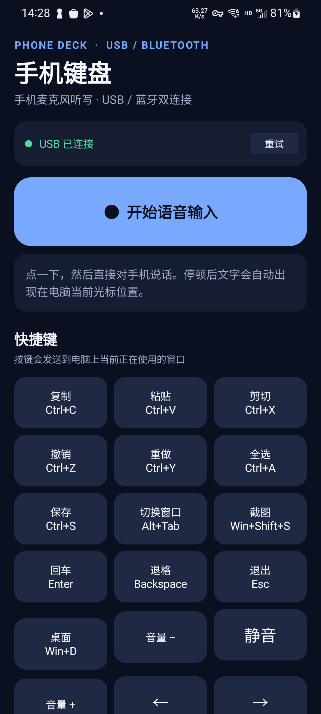

# PhoneDeck 手机控制台

PhoneDeck 把一台闲置 Android 手机变成电脑的语音输入面板和可编程快捷键控制台。手机麦克风负责采集声音，电脑端 Typeless 负责语音转文字；手机还可以发送复制、粘贴、截图、F1 等快捷键。长期目标是一台手机管理多台 Windows / macOS 电脑，并在手机上明确切换输入目标。

当前稳定基线是 **PhoneDeck 1.4.0**。仓库正在规划 1.5.0 及后续版本，尚未开始实现 1.5.0 功能。



## 项目所有者真正想实现什么

1. 闲置 Android 手机长期作为辅助键盘和手机麦克风使用。
2. 手机一键唤醒或停止电脑端 Typeless。
3. 支持“点击开始、再次点击停止”和“按住说话、松开停止”两种语音模式。
4. 快捷键按钮可由用户修改，例如把“截屏”改为 F1，或配置 Ctrl+C、Ctrl+Shift+S。
5. 加入 `/goal`、`/plan`、`/compact` 等文本命令，并为 Codex、Claude Code、ZCode、Cursor 提供语义化预设。
6. 一台手机管理两至四台 Windows / macOS 电脑；切换当前电脑后，语音和快捷键只进入目标电脑。
7. 支持直接 USB、USB 共享切换器、本地无线和蓝牙备用，不把产品锁死在一种传输方式上。
8. 项目可迁移到其他电脑继续开发、构建和发布。

完整、长期有效的产品规格见 [spec plan.markdown](./spec%20plan.markdown)。新的 Agent 在修改代码前必须先阅读该文档和 [AGENTS.md](./AGENTS.md)。

## 当前已经可以使用的功能

- 原生 Android Java App，最低 Android 8.0（API 26）。
- Windows x64、.NET 8 自包含接收端。
- USB ADB 反向隧道，服务仅监听 `127.0.0.1:8765`。
- 手机麦克风以 48 kHz / 16-bit / 单声道 PCM 传输到电脑。
- Windows 通过 NAudio/WASAPI 将音频写入 `CABLE Input (VB-Audio Virtual Cable)`。
- Typeless 从 `CABLE Output` 读取手机音频。
- 自动读取 Typeless 的主听写快捷键，读取失败时退回 RightAlt。
- 点击说话和按住说话两种模式。
- 手机端音量条、震动、等待、成功和失败反馈。
- 固定快捷键网格。
- 蓝牙 RFCOMM 快捷键备用通道；蓝牙暂不传输音频。
- 请求 ID、确认、有限重试和电脑端去重。
- Windows 运行包中已有 USB/ADB 自动恢复脚本模板。

## 当前尚未实现

- 用户自定义按钮和任意安全键位组合。
- 多配置、宏、快速文字和 AI 工具命令预设。
- 多电脑设备列表、局域网配对和手机内目标切换。
- macOS 接收端、Core Audio 和 macOS 输入注入。
- 正式的跨电脑配置同步。

不要把规划文档中的功能误认为已完成代码。

## 代码位置

```text
PhoneDeck/
├─ README.md
├─ AGENTS.md
├─ spec plan.markdown          # 唯一长期产品规格
├─ docs/
│  ├─ HANDOFF.md               # 当前状态与 Agent 接力说明
│  ├─ SETUP.md                 # 新电脑搭建、构建和运行
│  └─ ARCHITECTURE.md          # 当前与目标架构
├─ scripts/windows/            # 发行包辅助脚本模板
└─ work/phone-deck/
   ├─ android/                 # Android App
   ├─ windows/PhoneDeck.Server # Windows 接收端
   ├─ test/FocusSink           # Windows 输入验证小工具
   └─ SOURCE_README.md         # 1.4.0 源码说明
```

`outputs`、`work/tools`、编译缓存、APK/EXE、测试录音和签名文件不进入 Git。发布二进制应通过 GitHub Release 或另外生成，不要提交到源码历史。

## 快速构建

详细环境配置见 [docs/SETUP.md](./docs/SETUP.md)。

Android Debug APK：

```powershell
cd work\phone-deck\android
.\gradlew.bat :app:assembleDebug
```

Windows 接收端：

```powershell
dotnet publish work\phone-deck\windows\PhoneDeck.Server\PhoneDeck.Server.csproj `
  -c Release -r win-x64 --self-contained true -p:PublishSingleFile=true
```

## 接下来的开发顺序

1. 先修复并回归 USB 重连时可能残留音频/Typeless 状态的问题。
2. PhoneDeck 1.5.0：可编程快捷键、配置数据模型和协议 v2。
3. 协议 v2 从一开始预留 `computerId`、`targetComputerId`、平台和能力字段。
4. PhoneDeck 1.6.0：Windows 多电脑切换中心、安全配对和本地无线连接。
5. 实测正规的四电脑 USB 共享切换器，保留无局域网硬件模式。
6. PhoneDeck 1.7.0：多配置与前台软件自动切换。
7. PhoneDeck 1.8.0：宏、快速文字和 AI 编程工具命令。
8. PhoneDeck 2.0：macOS 接收端和 Windows/macOS 混合多电脑切换。

## 关键安全边界

- 不接受手机发送任意 PowerShell、CMD 或 shell 命令。
- 键位、宏、文本长度和运行目标必须由电脑端验证。
- USB 本地入口保持只监听 localhost。
- 局域网入口未来必须使用显式配对和消息认证，不能直接暴露当前无鉴权接口。
- 不提交 Android 签名密钥、ADB 私钥、令牌、录音或个人 Typeless 配置。

## 外部依赖

- [Typeless](https://www.typeless.com/)：电脑端语音转文字，用户自行安装。
- [VB-CABLE](https://vb-audio.com/Cable/)：Windows 虚拟音频设备，用户自行安装。
- Android SDK Platform Tools：ADB USB 通道。
- NAudio 2.2.1：Windows 接收端 NuGet 依赖。

Typeless、VB-CABLE 和未来可能使用的 macOS 虚拟音频软件不属于本仓库，也不会打包其安装文件。
