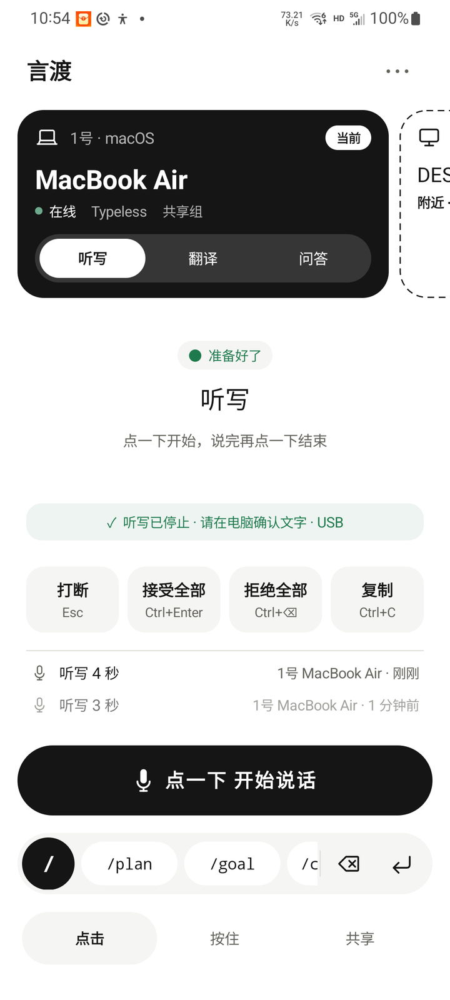
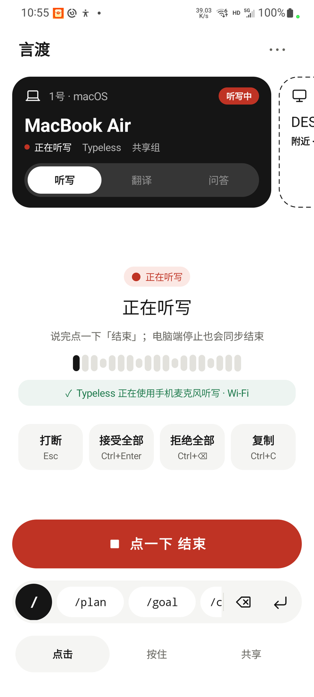
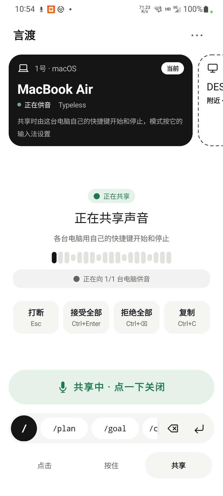

# 言渡 · Yandu

**把闲置的 Android 手机变成电脑的无线麦克风和快捷键面板。**

对着手机说话，文字出现在电脑上。一台手机可以连多台 Windows / Mac 电脑，左右滑动切换；也可以把麦克风共享给几台电脑，各自用自己的快捷键开始和停止。

[English](README.en.md) · [下载](https://github.com/leolemon777/PhoneDeck/releases) · [已知问题](docs/release/KNOWN_ISSUES.md) · [参与开发](CONTRIBUTING.md)

> **当前状态：技术预览。** 核心链路已在作者的设备上跑通，但还没有经过外部用户的干净安装测试。各平台验证程度见下方[验证情况](#验证情况)，遇到问题欢迎开 Issue。

| 待命 | 正在听写 | 共享麦克风 |
|---|---|---|
|  |  |  |

## 它是怎么工作的

```text
手机麦克风 ──Wi-Fi / USB──▶ 电脑上的言渡接收端 ──虚拟声卡──▶ 你的语音输入软件（Typeless 等）──▶ 文字
                                      └──────▶ 受控快捷键：复制、粘贴、/plan、回车…
```

言渡**不做语音识别**，只负责把手机的声音送进电脑，并替你按下语音输入软件的快捷键。识别由你电脑上已经在用的语音输入软件完成。

- **三种说话方式**：点击（点一下开始，再点结束）、按住（按下说话，松开结束）、共享（麦克风常开，各台电脑用自己的快捷键）。
- **三种电脑模式**：听写、翻译、问答，跟随所选语音软件的能力。
- **多台电脑**：同一 Wi-Fi 的电脑会自动出现在手机首页，点一下、核对四位校验码、在电脑上点「允许」即可连接，不用扫码。
- **快捷键面板**：复制、粘贴、截图、F1 等，以及 `/plan`、`/goal`、`/compact` 这类给 AI 编程工具的文本指令，都可以在手机上自定义。
- **八套配色**：墨白、暖纸、松绿、淡紫、陶土、雾蓝、墨白深色、极夜。

## 你需要准备

| | 要求 |
|---|---|
| 手机 | Android 8.0 及以上 |
| 电脑 | Windows 10/11 x64，或 macOS 14.2 及以上（Apple Silicon；Intel 可自行构建） |
| 语音输入软件 | 默认 [Typeless](https://www.typeless.com/)（付费）；也内置了豆包输入法、微信输入法的适配，其他软件可写 JSON 档案接入，见[语音引擎指南](docs/guides/VOICE_ENGINES.md) |
| 虚拟声卡（免费） | Windows：[VB-CABLE](https://vb-audio.com/Cable/)；Mac：[BlackHole 2ch](https://github.com/ExistentialAudio/BlackHole) |
| 网络 | 手机和电脑在同一个 Wi-Fi；或者用 USB 线 |

语音软件和虚拟声卡都需要你自己安装，本项目不打包它们。

## 安装

### 1. 电脑端

**Windows**（详细步骤见 [Windows 部署](docs/guides/WINDOWS_WIFI_DEPLOY.md)）

1. 安装 VB-CABLE（装完重启），在语音输入软件里把麦克风选成 `CABLE Output`。
2. 解压 Windows 接收端，右键 `Enable-PhoneDeckLan.ps1` →「使用 PowerShell 运行」，放行局域网端口。
3. 双击 `PhoneDeck.ControlCenter.exe`。右下角托盘出现言渡图标，状态窗口的检查清单全部打勾即可。

**Mac**（详细步骤见 [macOS 接收端](docs/guides/MACOS_SETUP.md)）

1. 安装 BlackHole 2ch，在语音输入软件里把麦克风选成 `BlackHole 2ch`。
2. 把 `PhoneDeck Receiver.app` 拖进「应用程序」并打开。目前没有苹果公证，第一次需要右键 →「打开」。
3. 在「系统设置 → 隐私与安全性 → 辅助功能」里允许 PhoneDeck Receiver（用来按语音软件的快捷键）。浏览器会打开本机状态页，检查清单全部打勾即可。

### 2. 手机端

1. 安装 APK，打开「言渡」。
2. 同一 Wi-Fi 下，首页会出现「附近 · 点按连接」的电脑卡片。点它，确认手机和电脑显示的四位校验码一致，在电脑上点「允许」。
3. 连上后按下方的「按住 说话」说话，松开结束；也可以切到「点击」模式，点一下开始、再点一下结束。

手机和电脑不在同一网段（比如隔了一层路由器）时，在「添加电脑 → 输入地址」里填电脑的局域网 IP。也可以用 USB 线连接：手机打开 USB 调试，电脑上需要有 [Android platform-tools](https://developer.android.com/tools/releases/platform-tools)（`adb`），接收端会自动建立并维持 `adb reverse` 通道。

## 验证情况

「代码通过构建」和「在真实设备上验证过」是两回事，下面只列后者。

| 平台 | 已在真机验证 | 还没验证 |
|---|---|---|
| Android | Samsung 上安装、首页、点击模式听写、电脑停止后手机同步关麦 | 其他机型、按住模式全流程、长时间共享 |
| Windows | 旧版托盘（1.6.0-dev.16）在作者电脑上的听写与快捷键 | 新版墨白托盘与「附近连接」、DPI 缩放 |
| macOS | Wi-Fi 听写最小闭环（2026-09-14）；新版精简接收端的状态页、USB 识别 | 新版的辅助功能授权后的听写 / 翻译 / 问答、Intel |
| 多台电脑 | 协议与并行探测的自动化测试 | 三台电脑同时在线、跨设备 mDNS 发现 |
| iPhone | — | 原生客户端尚未开发；有一个实验性网页版，见 [iPhone 网页](docs/guides/IPHONE_PWA.md) |

## 隐私

- **声音只去你自己的电脑**：手机的音频只经局域网或 USB 送到你的电脑，再交给你自选的语音软件。言渡没有云端识别、没有遥测、没有崩溃上报。
- **默认不落盘**：手机和电脑都不保存音频。电脑端只保存每台手机凭据的 SHA-256 哈希。
- **局域网加密**：Wi-Fi 通信使用 HTTPS，并在首次连接时固定电脑证书；不需要鉴权的入口只监听本机 `127.0.0.1`。
- 语音软件（如 Typeless）自身的数据处理以它们的隐私政策为准。
- 安全问题请不要开公开 Issue，见 [SECURITY.md](SECURITY.md)。

## 常见问题

**手机上看不到电脑？** 确认两边在同一 Wi-Fi、电脑端已启动；Windows 需要运行过 `Enable-PhoneDeckLan.ps1`。公司或学校网络常隔离设备，可改用「输入地址」或 USB。

**电脑上没有出字？** 打开电脑端状态窗口（Windows 托盘 / Mac 状态页），看检查清单哪一项没打勾。最常见的是语音软件的麦克风没选虚拟声卡，或 Mac 没有授权辅助功能。

**Mac 更新后快捷键失效？** 目前没有正式签名，每次更新都需要在「辅助功能」里把 PhoneDeck Receiver 删掉再重新添加。

**手机提示「电脑版本太旧」？** 旧接收端没有「附近连接」，请按上面的步骤更新电脑端。

**换了启动方式后手机认成了新电脑？** 电脑身份保存在接收端数据目录。Windows 托盘默认用程序旁的 `data` 文件夹，直接运行 `PhoneDeck.Server.exe` 默认用 `%LocalAppData%\PhoneDeck`；固定一种方式，或设置环境变量 `PHONEDECK_DATA_DIR`。Mac 默认在 `~/Library/Application Support/PhoneDeck`。

## 从源码构建

需要 .NET SDK 10（版本见 `global.json`）、JDK 17 和 Android SDK。完整环境说明见[开发环境](docs/guides/SETUP.md)，打包与发布流程见[构建流程](docs/BUILD_PIPELINE.md)。

```bash
# Android
cd work/phone-deck/android && ./gradlew :app:assembleDebug :app:testDebugUnitTest :app:lintDebug

# Windows 接收端（在 Mac/Linux 上交叉编译需加 -p:EnableWindowsTargeting=true）
dotnet test work/phone-deck/windows/PhoneDeck.Server.Tests/PhoneDeck.Server.Tests.csproj -c Release
dotnet publish work/phone-deck/windows/PhoneDeck.ControlCenter/PhoneDeck.ControlCenter.csproj \
  -c Release -r win-x64 --self-contained true -p:PublishSingleFile=true

# macOS 接收端（原生编译的精简版，约 21 MB）
dotnet test work/phone-deck/macos/PhoneDeck.Receiver.Tests/PhoneDeck.Receiver.Tests.csproj -c Release
zsh scripts/macos/Build-PhoneDeckReceiver.sh
```

也可以用统一入口 `./build.sh` 或 `pwsh ./build.ps1`（需要 PowerShell 7），产物在 `outputs/build-review/<runId>`。

## 项目结构

```text
PhoneDeck/
├─ work/phone-deck/
│  ├─ android/                     # Android App（Java）
│  ├─ windows/PhoneDeck.Server     # Windows 接收端
│  ├─ windows/PhoneDeck.ControlCenter  # Windows 托盘
│  ├─ macos/PhoneDeck.Receiver     # macOS 接收端
│  ├─ shared/                      # 两端共用的接收端代码与状态页
│  └─ desktop/                     # 实验路线：本地 Whisper 识别的 2.0 桌面版
├─ contracts/                      # 协议契约与校验脚本
├─ scripts/                        # 构建、打包、发布与 Windows 辅助脚本
├─ docs/                           # 文档，目录见 docs/README.md
└─ spec plan.markdown              # 产品规格与决策记录
```

除了主线（原生 App + 接收端），仓库里还有两条实验路线：手机网页版（[说明](docs/guides/TYPELESS_PWA.md)）和自带本地 Whisper 识别、不需要语音软件的 2.0 桌面版（[说明](docs/guides/DESKTOP_QUICK_START.md)）。它们没有主线成熟，欢迎试用和改进。

## 安全边界

- 手机不能让电脑执行任意 shell、PowerShell 或 CMD 命令。
- 按键、组合键、宏和文本长度都由电脑端按白名单校验，组合键最多 4 个键。
- 局域网入口使用 HTTPS、逐手机凭据、证书固定和目标电脑 ID 校验；电脑可以随时撤销某台手机。

## 参与开发

欢迎 Issue 和 PR，请先看 [CONTRIBUTING.md](CONTRIBUTING.md)。在仓库里工作的 AI 编程助手请先读 [AGENTS.md](AGENTS.md)；当前进度和待办在 [docs/HANDOFF.md](docs/HANDOFF.md)。

文档以中文为主，欢迎补充英文。

## 许可证

[MIT License](LICENSE)。语音引擎档案中的快捷键与进程名来自公开资料，Typeless、豆包、微信输入法、VB-CABLE、BlackHole 等商标和软件归各自所有者。
